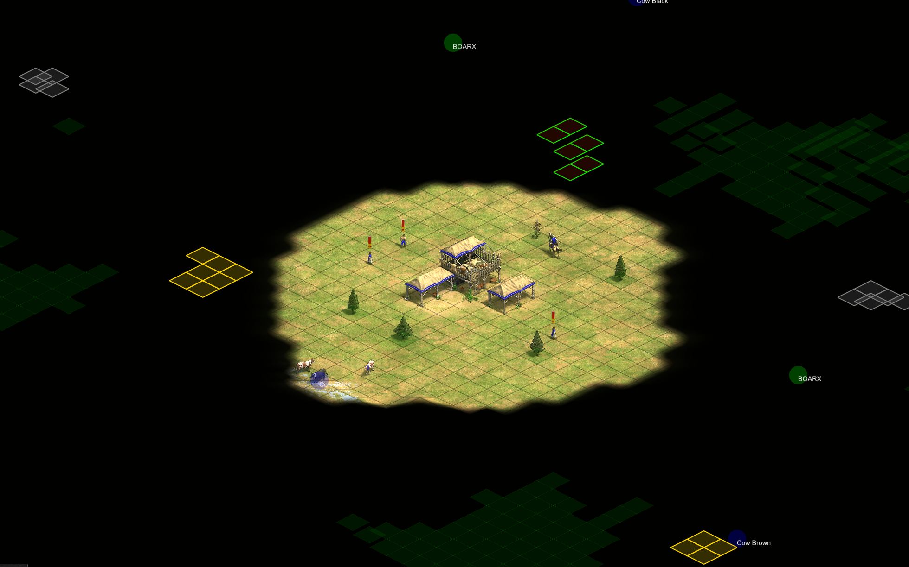
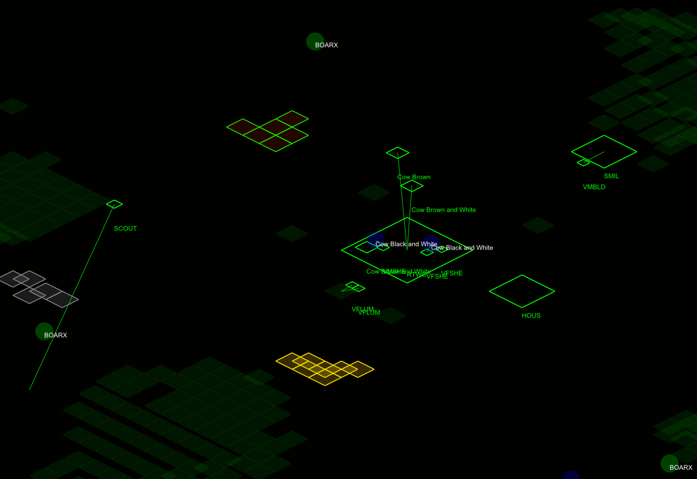
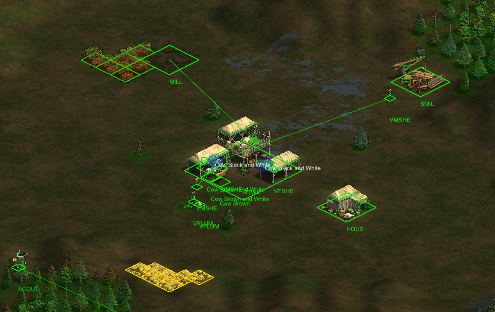
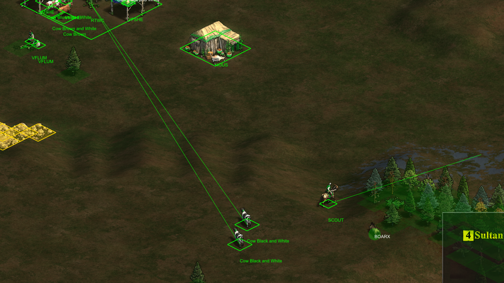
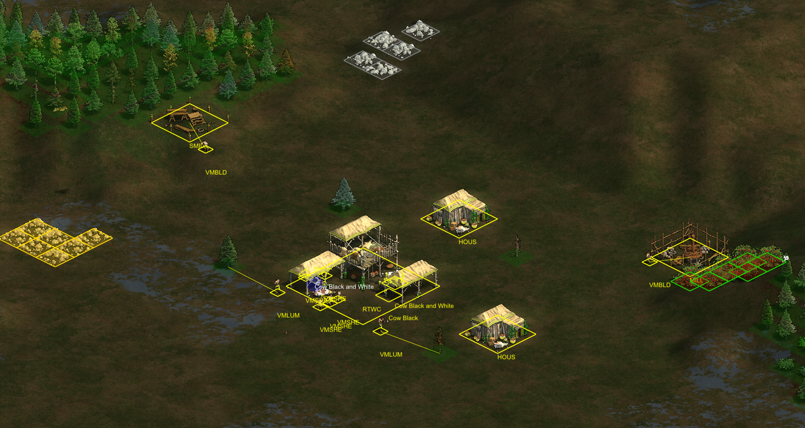

# Age of Empires 2 DE Mod Menu

Mod-Menü für Age of Empires II: Definitive Edition mit zusätzlichen Spieloptionen. Funktioniert mit der Steam-Version unter Windows 10/11.

---

## Funktionen

- Full Map Reveal
- Unit Vision Through Fog
- Mini-Map Display
- Resource Overview
- Auto Villager Production
- Auto Monk Training
- Automatic Building
- Deer Herding Assist
- Auto Combat Dodge
- Early Enemy Harass

---

## Screenshots

---

## Über die Software

- Läuft lokal – keine Admin-Rechte nötig, keine Installationen im System
- Transparent – nur Verbindung zum Spiel und Lizenzserver, keine Hintergrundaktivitäten
- Nur für privaten Gebrauch – Steam-Version, Windows 10/11
- **Nur im Singleplayer verwenden**

---

## Support

Bei Fragen: Kontakt über Discord.
